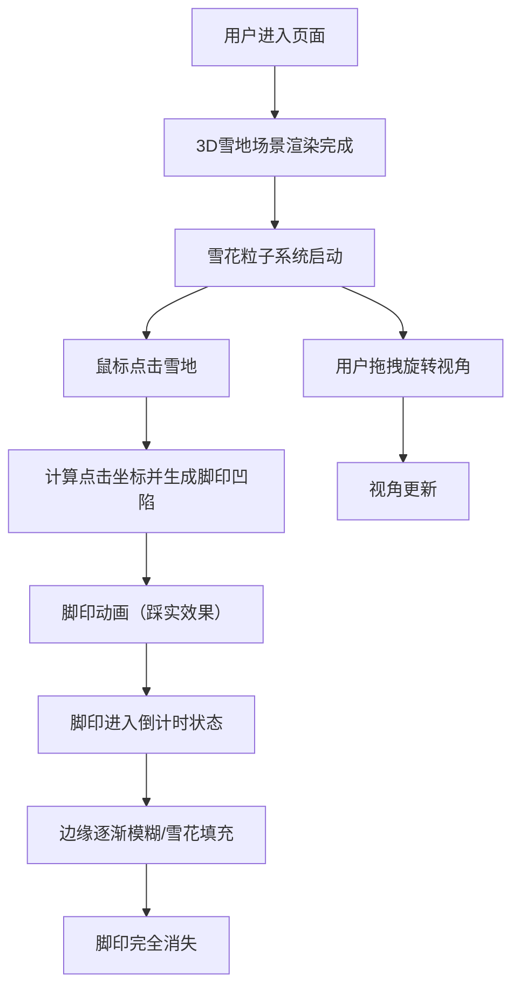

## 1. 产品概述
3D雪地脚印互动体验网页，用户可以在一片皑皑白雪的庭院场景中，通过鼠标点击在雪面上踩出一个个真实的3D脚印凹陷，模拟人在雪地行走留下的痕迹，随后脚印会随着飘落的雪花逐渐被填满直至消失，营造出静谧冬日的沉浸感。

- 目标用户：喜欢互动体验、3D视觉效果的网页用户
- 产品价值：提供一个有艺术感、解压放松的冬日互动体验场景

## 2. 核心特性

### 2.1 功能模块

1. **3D雪地主场景**：高度还原的白雪覆盖庭院，包含地形起伏、光照阴影、大气效果
2. **脚印交互系统**：鼠标点击生成3D脚印凹陷，带有踩实雪粒的质感细节
3. **雪花粒子系统**：持续飘落的雪花，随时间积累填充脚印
4. **脚印消散动画**：脚印边缘逐渐模糊、被新雪覆盖直至完全消失
5. **视角控制系统**：支持鼠标拖拽旋转、缩放视角，观察雪地起伏细节
6. **参数控制面板**：可调节降雪速度和脚印消失速度

### 2.2 页面详情

| 页面名称 | 模块名称 | 功能描述 |
|-----------|-------------|---------------------|
| 主页面 | 3D雪地场景 | 全屏3D渲染雪地，支持点击交互 |
| 主页面 | 控制面板 | 右上角悬浮半透明面板，包含两个滑块调节参数 |
| 主页面 | 操作提示 | 左下角半透明提示文字，引导用户操作 |

## 3. 核心流程

用户打开页面 → 看到一片纯净的新雪覆盖庭院 → 鼠标在雪面上点击 → 踩出脚印凹陷（有轻微雪粒飞溅） → 雪花持续飘落 → 脚印边缘逐渐模糊 → 脚印被新雪完全覆盖消失 → 用户可以继续点击新的脚印

## 4. 用户界面设计

### 4.1 设计风格
- **主色调**：冷色系，以纯白 `#F8FAFC` 为主，天空灰蓝渐变 `#B8D4E8 → #E8F0F8`，阴影使用淡紫灰 `#94A3B8`
- **点缀色**：脚印深色 `#CBD5E1`，控制面板背景半透明毛玻璃效果
- **按钮样式**：圆角胶囊形滑块，半透明背景，白色描边
- **字体**：中文使用"思源黑体/Noto Sans SC"，英文使用"Poppins"，标题使用轻盈的细体字重
- **布局风格**：全屏沉浸式3D场景，UI控件悬浮于场景之上采用毛玻璃效果
- **图标**：使用 Lucide React 图标，线性风格

### 4.2 页面设计概览

| 页面名称 | 模块名称 | UI元素 |
|-----------|-------------|-------------|
| 主页面 | 3D场景 | 全屏雪地，有微弱地形起伏，柔和环境光+方向光投影，冷色调天空盒 |
| 主页面 | 控制面板 | 右上角毛玻璃卡片，标题"场景参数"，两个带标签的滑块 |
| 主页面 | 提示栏 | 左下角半透明文字提示，带淡入动画 |

### 4.3 响应式
- Desktop-first设计，全屏3D场景自适应窗口大小
- 移动端触控替代鼠标点击操作
- 控制面板在小屏设备上移至底部或变为可折叠抽屉

### 4.4 3D场景指导
- **环境与氛围**：清晨冬日雪景，柔和薄雾，远景有微弱树木轮廓剪影
- **光照设置**：方向光模拟晨光（浅黄白色，角度约45度），半球光提供环境补光，阴影使用PCFSoftShadowMap
- **相机设置**：初始使用透视相机（PerspectiveCamera），位置略高俯视雪地，OrbitControls限制最小/最大距离
- **构图与焦点**：雪地占据画面主体70%以上，地平线位于画面上1/3处，留有足够天空营造氛围
- **交互与动画**：点击时脚印凹陷有轻微下移动画，雪花粒子自上而下旋转飘落，脚印消失时高度渐变恢复
- **后处理效果**：轻微Bloom泛光、色调映射（ACESFilmicToneMapping）、远景雾效
- **性能预算**：地形使用256x256顶点平面，脚印使用Canvas绘制heightmap动态更新，雪花粒子控制在2000个以内
