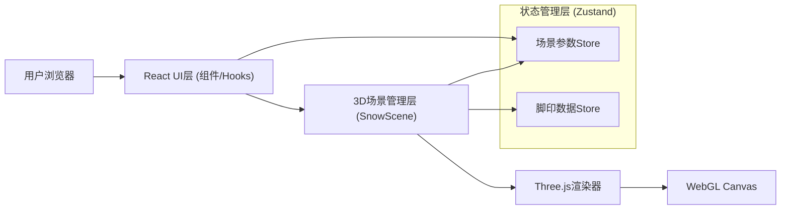

## 1. 架构设计



## 2. 技术描述
- **前端**：React@18 + TypeScript + Vite
- **样式**：TailwindCSS@3
- **状态管理**：Zustand
- **3D渲染**：three@^0.160.0
- **辅助库**：@react-three/fiber@^8.15, @react-three/drei@^9.92, @react-three/postprocessing@^2.15
- **后端**：无（纯前端项目）
- **数据库**：无

## 3. 目录结构

```
src/
├── components/
│   ├── SnowScene.tsx        # 3D雪地主场景组件
│   ├── SnowTerrain.tsx      # 雪地地形（含脚印高度图逻辑）
│   ├── Snowflakes.tsx       # 雪花粒子系统
│   ├── ControlPanel.tsx     # 参数控制面板
│   └── HintOverlay.tsx      # 操作提示层
├── hooks/
│   ├── useFootprints.ts     # 脚印数据管理Hook
│   └── useSnowParams.ts     # 场景参数Hook
├── store/
│   └── sceneStore.ts        # Zustand全局状态
├── utils/
│   └── footprintShape.ts    # 脚印形状生成工具
├── pages/
│   └── Home.tsx             # 主页
├── App.tsx
├── main.tsx
└── index.css
```

## 4. 核心实现方案

### 4.1 雪地脚印凹陷实现
- 使用 `PlaneGeometry` 创建高细分（256×256）平面作为雪地
- 维护一张 `Uint8Array` 高度图（heightmap），记录每个顶点的高度偏移
- 每次点击时，将脚印形状（通过Canvas生成的灰度图）叠加到高度图对应位置
- 每帧根据高度图更新 `geometry.attributes.position` 的Y坐标
- 使用 `MeshStandardMaterial` 配合 normalMap 增加雪粒质感

### 4.2 脚印消失机制
- 每个脚印记录生成时间戳、位置、大小、当前填充度
- 每帧遍历所有脚印，根据"消失速度"参数增加填充度
- 填充度会从高度图中减去对应脚印形状，逐渐恢复原始高度
- 当填充度达到100%时从脚印列表中移除

### 4.3 雪花粒子系统
- 使用 `@react-three/drei` 的 `Points` + `BufferGeometry`
- 2000个粒子，随机分布在空中并向下飘落，带有轻微X/Z漂移和旋转
- 位置超出地面后重置到顶部，形成无限循环
- 粒子大小根据距离缩放，使用半透明圆形纹理

### 4.4 视角控制
- 使用 `@react-three/drei` 的 `OrbitControls`
- 限制：`minDistance=5`, `maxDistance=30`, `minPolarAngle=0.2`, `maxPolarAngle=Math.PI/2 - 0.1`
- 开启阻尼效果（enableDamping）让旋转更顺滑

### 4.5 控制面板
- 两个 `<input type="range">` 滑块
- 降雪速度：0.1× ~ 5×，影响粒子下落速度
- 脚印消失速度：0.5× ~ 3×，影响脚印填充速度
- 使用 Zustand store 共享参数，3D场景订阅变化
